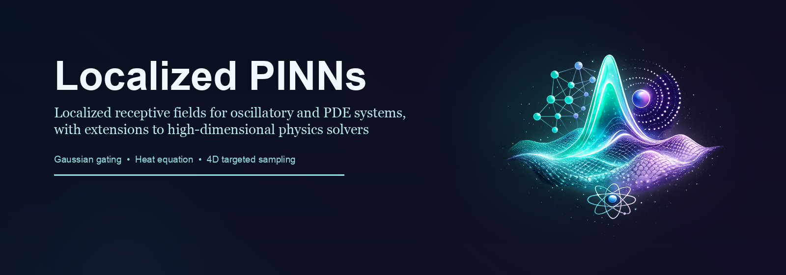

<p align="center">
  
</p>

# Localized PINNs

Localized PINNs explores whether physics-informed neural networks can be made easier to optimize by giving neurons a local receptive field instead of asking one dense network to represent the full domain uniformly.

This repository is an archival research workspace. It is notebook-heavy, exploratory, and organized around three experiment families:

- `HO/`: nonlinear harmonic oscillator experiments, which contain most of the localization work.
- `Heat Equation/`: space-time PINN extensions of the same idea.
- `4D/`: later high-dimensional experiments that combine localization with targeted sampling.

Current run status, working branches, and blockers live in [status.md](status.md).

## Research Idea

The central pattern is to multiply neuron activations by localized kernels so different units specialize over different parts of the domain.

In the main Gaussian branch, a first-layer activation is gated by

```text
exp(-(x - mu)^2 / (2 sigma^2))
```

and neighboring branches test alternative localizers:

- Gaussian gating
- activated localization
- super-Gaussian gating
- boxcar localization
- ricker-wavelet localization
- layerwise localization in 4D

The repo also contains side experiments with attention, embedding-based time features, and PICNNIC-inspired ideas.

## Repository Layout

```text
.
├── HO/
│   ├── gaussian/
│   ├── activated localization/
│   ├── super gaussian/
│   ├── boxcar/
│   ├── ricker wavelet/
│   └── PICNNIC/
├── Heat Equation/
│   ├── Gaussian/
│   └── Activated localization/
├── 4D/
├── logo.png
├── assets/poster.png
├── README.md
└── status.md
```

## Most Relevant Branches

- `HO/gaussian/Single Layer/`: main harmonic-oscillator Gaussian localization line, including the direct localization-vs-baseline comparison notebook.
- `HO/gaussian/Multiple Layers/`: extension of localization across several layers.
- `HO/activated localization/`: variant where localization is tied more directly to intermediate activations.
- `Heat Equation/Gaussian/`: strongest saved heat-equation branch.
- `4D/`: latest active direction, with localized networks plus target-biased Latin-hypercube sampling.

## Current State

- The repo does contain executed “final run” notebooks for the main HO Gaussian, HO activated, HO multi-layer Gaussian, and heat-equation Gaussian branches.
- The heat-equation activated-localization branch is currently broken and needs repair before reuse.
- The 4D branch is the latest work chronologically and appears to be the best candidate for the next round of cleanup and Slurm migration.
- There are currently no CLI runners, Slurm scripts, result registries, or automated tests in this folder.

## Reproducibility Notes

The code is written around PyTorch and Neurodiffeq, but some experiments require additional packages or local environment assumptions:

- `torch`
- `numpy`
- `matplotlib`
- `seaborn`
- `scipy`
- `neurodiffeq`
- `neurodiffeq_conditions` for the 4D notebooks
- `scikit-learn` for some PICNNIC notebooks
- Jupyter notebook execution environment

Some older exploratory notebooks also assume a local modified checkout of `neurodiffeq`, so not every notebook is expected to run unchanged on a clean machine.

## Poster Asset

The banner at the top of this README is generated from `logo.png` using [scripts/generate_poster.py](scripts/generate_poster.py).
